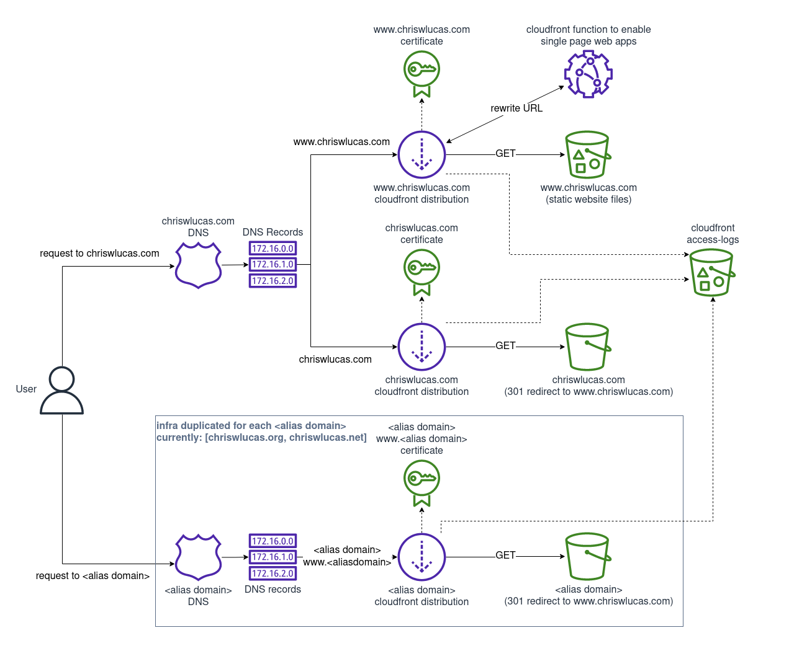

<!--summary-->

I've recently taken some time to re-work my website from a hand-coded resume site[^1] to modernize it and include a blog. [Hugo](https://gohugo.io/) does all the heavy-lifting for the site content which is great since I'm not a web developer. Now that it's all set up, I just have to write markdown to produce content.

I've been hosting the old version of the site with AWS S3 + CloudFront for a few years, but it wasn't documented well and some parts of this broke when migrating the content to Hugo. This post a snapshot of how I've configured my domain and site hosting infrastructure, why it's like this, and how much it costs.

<!--more-->

## Infrastructure Requirements
### Behavior
I wanted the infa for this site to be configured such that:
* Static website content is hosted at [https://www.chriswlucas.com](https://www.chriswlucas.com)
* All of the following alias domains redirect[^2] to `www.chriswlucas.com`:
    * `chriswlucas.com`
    * `chriswlucas.org`
    * `www.chriswlucas.org`
    * `chriswlucas.net`
    * `www.chriswlucas.net`
* Any request using `http` protocol is automatically redirected to use `https`
* Redirection for any reason must preserve the page of the request
    * e.g. [http://chriswlucas.net/about/](http://chriswlucas.net/about/) redirects to `https://www.chriswlucas.com/about/`

### Tools
I have chosen to set up the infrastructure with AWS mostly because I have experience with AWS. I'm happy with the amount of control I have over the infrastructure while also having powerful tools to write infrastructure-as-code. I'm sure other providers have similar offerings but this is what was easiest for me.

I'm using AWS [Route53](https://aws.amazon.com/route53/), [S3](https://aws.amazon.com/s3/), [Certificate Manager](https://aws.amazon.com/certificate-manager/), and [CloudFront](https://aws.amazon.com/cloudfront/) for the actual infrastructure.

The infrastructure-as-code is using AWS [CDK](https://aws.amazon.com/cdk/) (v2) which enables me to write TypeScript code to generate the infrastructure and deploy it as a [CloudFormation](https://aws.amazon.com/cloudformation/) template.

## How it works

### Components

#### Domains
* Domains registered with AWS Route53: `chriswlucas.com`, `chriswlucas.org`, `chriswlucas.net`
* Route53 hosted zone created for each domain for DNS

#### Hosting `www.chriswlucas.com`
The overall behavior is that a request for a page on `www.chriswlucas.com` hits a CloudFront distribution - which serves the page from its cache if present or retrieves the page from S3 and returns it while caching it for later requests if not present.

* Static website content synchronized to S3 bucket named `www.chriswlucas.com`
* Certificate for `www.chriswlucas.com` registered with AWS Certificate Manager (ACM)
* CloudFront distribution to serve web traffic for https://www.chriswlucas.com
    * uses the certificate to enable `https`
    * acts as a read-through cache when fetching requested objects from the S3 bucket
    * included a CloudFront function to re-write requests which is [described later](#are-all-those-cloudfront-distributions-really-necessary)
* DNS `A` record in the `chriswlucas.com` hosted zone pointing `www.chriswlucas.com` to the CloudFront distribution

#### Redirecting `chriswlucas.com` to `www.chriswlucas.com`
The overall behavior is that a request for a page on `chriswlucas.com` results in a 301 redirect for the page on `www.chriswlucas.com`

* S3 bucket named `chriswlucas.com` configured to redirect any requests to the DNS name `www.chriswlucas.com`
* Certificate for `chriswlucas.com` registered with ACM
* CloudFront distribution using certificate to host https://chriswlucas.com
* DNS `A` record in the `chriswlucas.com` hosted zone pointing `chriswlucas.com` to the CloudFront distribution

#### Redirecting each `<alias domain>` and `www.<alias domain` to `www.chriswlucas.com`
Largely the same as the section above to redirect `chriswlucas.com` to `www.chriswlucas.com`. That S3 + ACM + CloudFront infrastructure block is repeated for each alias domain with the modification of the certificate and distribution also being configured to accept the `www` subdomain as an alternate name.

### Architecture diagram
Here's a picture of how it is all connected



### Are all those CloudFront distributions really necessary‽
S3 buckets can support website hosting themselves, but do not support `https` endpoints. Since I want to have `https`, the best solution within AWS is to use ACM for the certificate and CloudFront for the endpoint. So to even have the site use `https` I need to have a distribution for `www.chriswlucas.com`.

However, I want `https` redirection to work from any of the alias domains. So, that requires hosting those domains with `https` too. Therefore, each of the S3 buckets configured for redirection needs it's own CloudFront distribution in front of it to support even accepting traffic on `https` before redirecting it.


### What's that CloudFront function?
Hugo uses "pretty" URLs by default and I like them.
``` bash
# pretty URL (default)
/posts/the-infrastructure-hosting-this-site/

# the alternate ugly URL (uglyurls: true)
/posts/the-infrastructure-hosting-this-site.html
```

However, CloudFront doesn't have a native feature to append `index.html` to the end of arbitrary requests. As an example, the URL bar of your browser *likely* ends with `/posts/the-infrastructure-hosting-this-site/` right now. But the page you're reading is actually served from `/posts/the-infrastructure-hosting-this-site/index.html`[^3].

To enable using the pretty urls, I'm using a [CloudFront function](https://aws.amazon.com/blogs/aws/introducing-cloudfront-functions-run-your-code-at-the-edge-with-low-latency-at-any-scale/) (a feature launched in 2021) - another option is to use Lambda@Edge but that is more complex than necessary for this feature and also costs more.

The aws-samples repo [includes a function](https://github.com/aws-samples/amazon-cloudfront-functions/blob/main/url-rewrite-single-page-apps/index.js) to re-write URLs that works perfectly for pretty URLs so this is what I use to make it work.

## Cost
At the current traffic levels the site amortized cost < $5/month. This cost will increase over time if traffic increases and I will be watching it, but it's good to know that the "scale to zero" cost for all of this is about $5/month and more than half of that is in the domain registration fees.

### Route 53
* three domains cost a total of $35/year or $2.92/month
* $0.50/month for each of my 3 hosted zones -> $1.50/month
* DNS queries -> $0.01/month

### S3
* storage -> $0.35/month
* requests -> $0.01/month

### CloudFront
* requests (free tier) -> $0/month
* bandwidth (free tier) -> $0/month
* function executions (free tier) -> $0/month

## Is it worth doing all this?

Possibly not. Before using custom infrastructure for hosting, I used GoDaddy DNS and [NearlyFreeSpeech.net](https://www.nearlyfreespeech.net/) for hosting and that was slightly cheaper since I didn't have to pay $0.50/month for the privilege of having DNS for the domain. I was particularly impressed with `NearlyFreeSpeech.net` as I was able to host my resume site for pennies per month over the span of several years.

However, I think the idea of self-hosting, working directly with infrastructure, and utilizing infrastructure-as-code is cool enough to going through all this effort. And since all the infrastructure is serverless and scales down to $5/month with no traffic, I don't have to worry about maintaining it on a daily basis or paying too much if no one is looking at it.

### Future work
The infrastructure does not yet support building and deploying the website automatically. In the future I'd like to set up a mechanism that listens for commits on the website content repo which builds the website and deploys it to the S3 bucket automatically. Having continuous deployment would be great, it just didn't make it into v1 since Hugo has built-in support to deploy to S3 + CloudFront.

### The code
All of infrastructure described here is infrastructure-as-code using AWS CDK and available on [GitHub](https://github.com/cwlucas41/personal-website-cdk). Anyone can fork the code, make a few configuration tweaks, and have identical infrastructure up and running.

The only bits that are not automated are registering the domains as registering a domain is not supported by CloudFormation/CDK.

<!--footnotes-->

[^1]: The previous version is [still available on GitHub](https://github.com/cwlucas41/personal-website-content/tree/07bf05df240814929236deb262dc7bf9893294a2).

[^2]: My old website was available at multiple domains without redirection. For example, If you navigated `chriswlucas.net` then that name would stay in the URL bar after loading the site. This was slick, but doesn't nicely with absolute URLs in general and specifically broke the Hugo site when setting a domain as the [baseUrl](https://gohugo.io/getting-started/configuration/#baseurl). There are [other ways](https://discourse.gohugo.io/t/can-hugo-generate-one-site-for-multiple-domains/6328) around this, but it sounded easier, more robust, and more like the behavior of other sites to just serve the site at one domain name and have any other alias names redirect to primary one.

[^3]: you can [go there directly](https://chriswlucas.com/posts/the-infrastructure-hosting-this-site/index.html)
